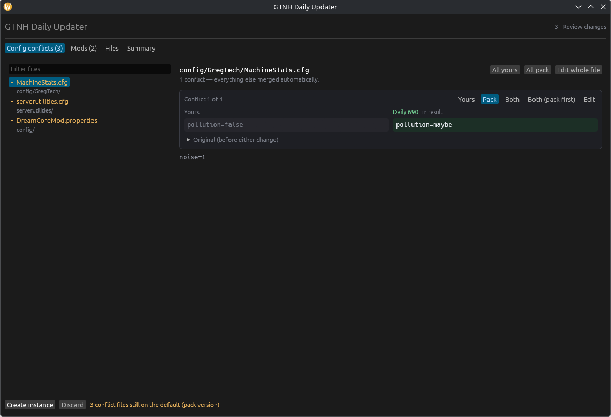

# GTNH Daily Updater

Updates a [GregTech: New Horizons](https://www.gtnewhorizons.com/) instance in
[Prism Launcher](https://prismlauncher.org/) to the latest daily build — without
losing your config edits, your extra mods, or your worlds.

It follows the wiki's
[recommended method](https://wiki.gtnewhorizons.com/wiki/Installing_and_Migrating#Method_1:_Migrating_to_a_New_Instance_(Recommended)):
a brand-new instance every time, your old one left completely untouched. It just
does the tedious parts for you.

> [!NOTE]
> **This was 100% coded with AI**, as a personal hobby project. It is not affiliated
> with the GTNH team. It works well for me, but read what it is about to do before
> clicking the button, and keep backups of your saves.

## What it does

- **Merges your configs** instead of overwriting them. Lines you changed and lines
  the pack changed both survive; you only get asked about genuine collisions.
- **Asks before deleting mods.** Anything the new build dropped, and anything you
  added yourself, gets a checkbox.
- **Remembers which mods you switched off** and switches them off again.
- **Moves everything else across**: worlds, resource packs, shaders, waypoints,
  screenshots, schematics.
- **Keeps your launch settings**: Java version, JVM arguments, memory limits. Forge
  and lwjgl3ify come from the new pack.



## Getting started

1. Download the latest build for your system from the
   [releases page](../../releases) and unzip it.
   - Windows: `gtnh-updater-windows-x86_64.zip`
   - Linux: `gtnh-updater-linux-x86_64.tar.gz`
2. **Get a GitHub token.** Daily builds live as GitHub Actions artifacts, and
   downloading one needs a token even though the repo is public. Make a
   [personal access token](https://github.com/settings/tokens) — a classic token
   with the `public_repo` scope is enough — and paste it into the box under
   "GitHub token". (If you have the `gh` CLI signed in, it is picked up
   automatically and you can skip this.)
3. Run it. Pick your instance, pick a build, press **Start update**.
4. Review what will change, then press **Create instance**.
5. Restart Prism if the new instance does not show up straight away.

The download is around 700 MB, so the first step takes a few minutes.

## Reviewing changes

Most updates need almost nothing from you — going from daily 641 to 690 on my own
instance came out as 11,199 files identical, 708 taken from the pack, 86 of my edits
kept, and **2 actual conflicts**.

When there is a conflict, you get a side-by-side view of your version and the pack's,
and can take either one, both, or edit the result by hand.

## Command line

Handy for a scheduled check:

```bash
gtnh-updater --check
```

| command | what it does |
| --- | --- |
| `--check` | print which build you are on and what is available |
| `--plan` | download and compare, print a report, change nothing |
| `--apply` | do the update, resolving conflicts by policy |
| `--ui-preview` | open the interface with sample data |

Add `--instance DIR` to pick an instance, `--build N` for a specific daily,
`--on-conflict yours` to prefer your version, or `--help` for the rest.

## How the merging works

A proper three-way merge needs to know what the file looked like *before* either of
you changed it. The updater gets that from one of two places:

- a snapshot it saved in `<instance>/.gtnh-updater/` when it built the instance, or
- on a first run, the artifact of the build you are on — read with HTTP range
  requests, so it pulls a few hundred KB out of the 700 MB zip instead of all of it.

Then every file follows the same rule:

| you changed it | the pack changed it | result |
| --- | --- | --- |
| no | no | nothing to do |
| no | yes | the pack's version |
| yes | no | your version |
| yes | yes, elsewhere | merged automatically |
| yes | yes, same lines | you choose |

If the build you are on has aged out of GitHub's artifact retention, the original is
gone and every changed file becomes a straight yours-or-pack choice instead. The
snapshot avoids that from the first update onward.

## Building it yourself

```bash
cargo build --release
```

Linux also needs `libxkbcommon-dev`, `libwayland-dev` and the usual xcb dev packages.

## License

MIT
